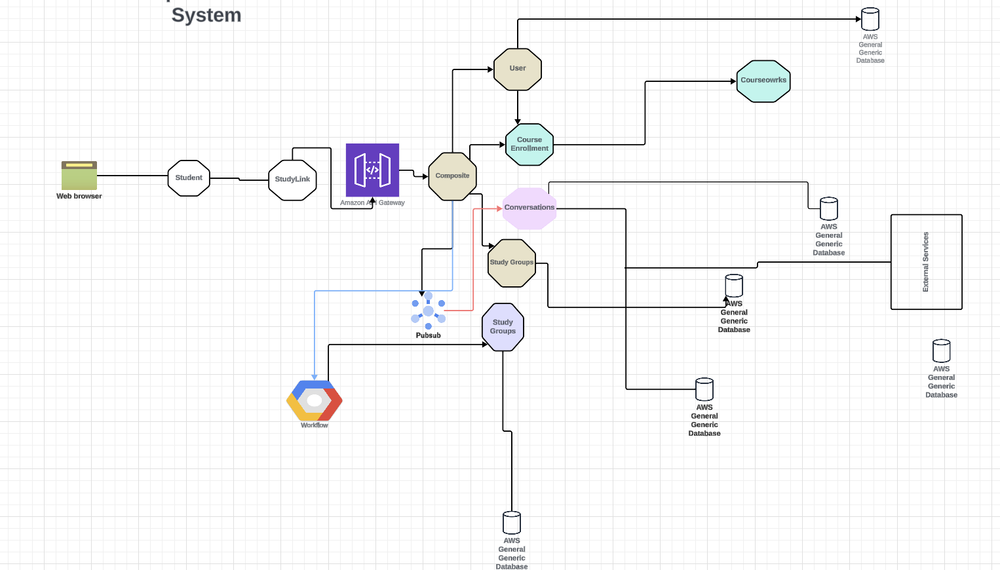

# Welcome to StudyLink app
StudyLink is an app designed to help students easily make study buddies with peers from their university classes. By offering a way to find classmates and reach out, StudyLink reduces the anxiety of asking for help in large lectures and creates a more personal and approachable environment for students who want to practice, collaborate, or seek help in their courses. Using the Canvas API, StudyLink automates the process of pulling student enrollment data and course information, making it effortless for students to discover peers in their classes for collaboration and study sessions.
Some examples of the tasks StudyLink addresses are:
- Automatically listing all of the courses in which a student is enrolled
- After selecting a class, students can see a list of classmates who are also using the app. 
- Syncing with course materials and assignments, allows students to specify which assignments, lectures, or projects the students want to discuss or collaborate on.
- Providing class-specific schedules and deadlines, helping students organize study sessions around important course events like exams and project deadlines.
- Facilitating communication between students via in-app messaging, uni email, or external messaging services 

StudyLink is a cloud-based app that delivers a significant improvement in how students connect for academic collaboration, making it easier to form study groups and engage with peers. The value to students is increased access to study support and reduced anxiety in large, impersonal lecture settings. The benefit to universities is that StudyLink fosters a more supported, connected, and collaborative student body.

## Team Contribution
|Name  | Contribution |
|:------- | :--------- |
|Emanuela Romano | UI |
|Sumya Hoque | Composite Service|
|Jonathan Cheung | Chat Service |
|Amelie Scheil | User Service |
|Jessica Liang | StudyGroup Service|
|Jeannie Moreno | Course Enrollment Service|
## Key Micro Services
### User Service
- <b>Registration & Login</b>: Creating user account and handling login. Also, handle authentication and authorization
- <b>Profile Management</b>: User can update and manage their profile
### Study Group Service
- <b>Group management</b>: Handle the creation of study group, update and managing the group
### Chat Service
- <b>Chat Mangement</b>: User can create, update and delete chat with a fellow group member
### Course Enrollment Service 
- <b>Course Enrollment Data Collection</b>: pulls the enrollment data from the university's system via the Canvas API. It is responsible for listing all the courses a student is enrolled in and all the students enrolled in a course. Accepts GET requests.
### UI service
- <b>User Interaction</b>:Responsile for handling user request. This is the main froentend service, intreagtedd with API gateway along wilt Composite service
### Composite Service
- <b>Aggregatiion and Redirection of requests</b>: This service  calls all the downstream services in both synchronous, asychronous way. Apply service chroreography and orchestration. 
## Tech Stack
- <b>Frontend</b>: React + Redux
- <b>Backend</b> Python FastAPI
- <b>Databse</b>: MySQL
## Deployments
- <b>User Service</b> : EC2
- <b>Study Group</b>: GCP(DOCKER)
- <b>Chat Service</b>: GCP(VM)
- <b>Course Enrollment Service</b>: EC2
- <b>Composite Service </b>: GCP(PaaS)
- <b> UI</b>: Google BLOB storage
## DEMO
Please follow [this](https://drive.google.com/file/d/1ctcgWbEldUpxVzwH6jqTsQsXYTOHrdF_/view)

## Interactive Operational System

For More info, follow our [Project Design PDF](https://github.com/hoquesumya/StudyLink/blob/main/Project_design.pdf)
